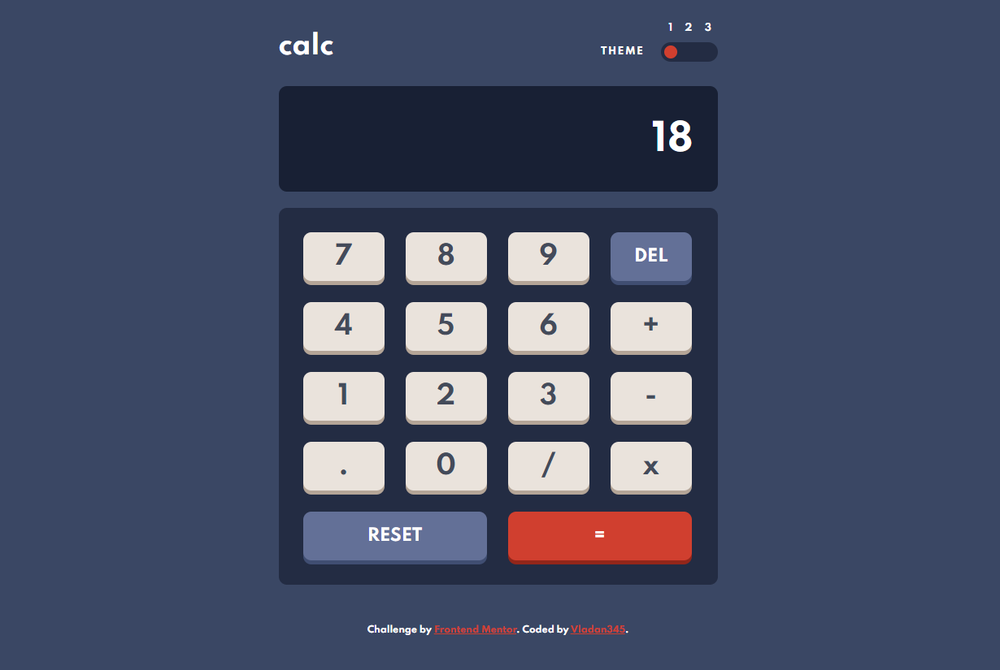

# Frontend Mentor - Calculator app solution

This is a solution to the [Calculator app challenge on Frontend Mentor](https://www.frontendmentor.io/challenges/calculator-app-9lteq5N29). Frontend Mentor challenges help you improve your coding skills by building realistic projects.

## Table of contents

- [Overview](#overview)
  - [The challenge](#the-challenge)
  - [Screenshot](#screenshot)
  - [Links](#links)
- [My process](#my-process)
  - [Built with](#built-with)
  - [What I learned](#what-i-learned)
  - [Continued development](#continued-development)
- [Author](#author)

## Overview

### The challenge

Users should be able to:

- See the size of the elements adjust based on their device's screen size
- Perform mathmatical operations like addition, subtraction, multiplication, and division
- Adjust the color theme based on their preference
- **Bonus**: Have their initial theme preference checked using `prefers-color-scheme` and have any additional changes saved in the browser

### Screenshot

### Links

- Live Site URL: [Add live site URL here](https://vladan345.github.io/daily-calculator/)

## My process

### Built with

- Semantic HTML5 markup
- CSS custom properties
- Flexbox
- CSS Grid
- Javascript

### What I learned

The main thing I learned from this project is the global eval() function in javascript that takes a string as a parameter,
makes calculation and return the value also as a string. This function saved me from lots of writing.
Also, theme changer was new to me but it was pretty fun.

### Continued development

This project was more of a recap of basic javascript and DOM manipulation for me, but that theme changer solution doesn't look very efficient for me so I would definitely try to change that and maybe add that bonus "saving user theme preference" functionality.

## Author

- Website - [vladan345](https://vladan345.github.io/daily-calculator/)
- Frontend Mentor - [@vladan345](https://www.frontendmentor.io/profile/yourusername)
